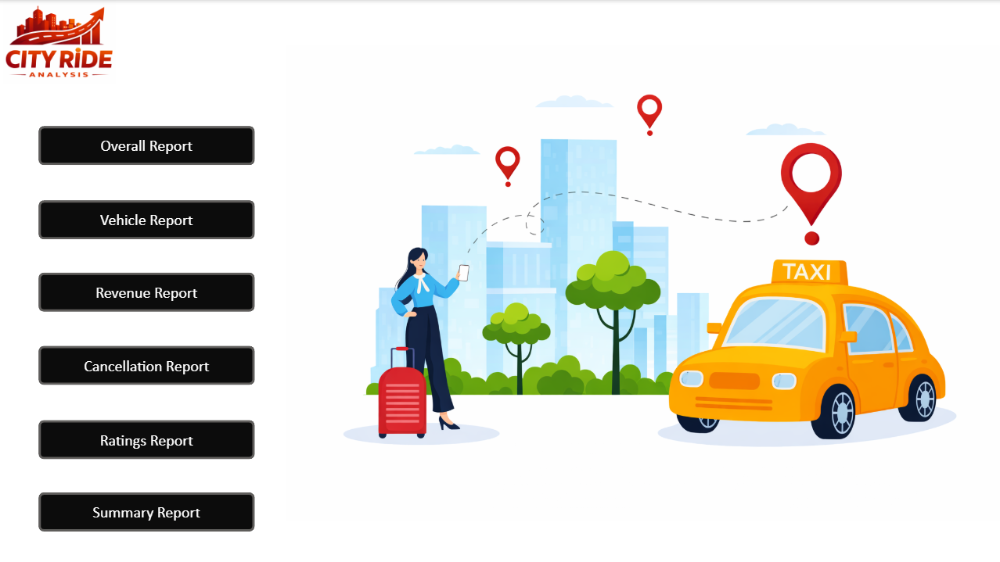
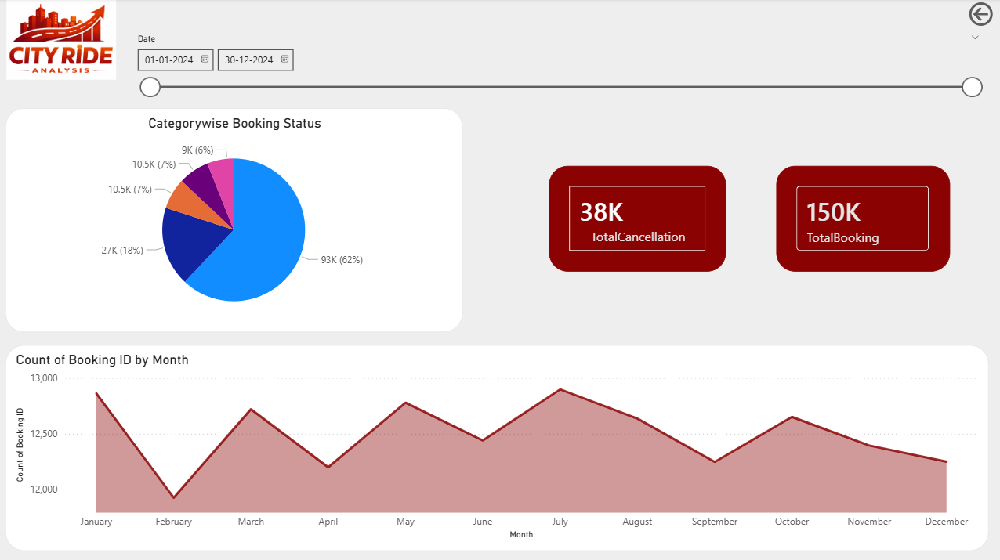
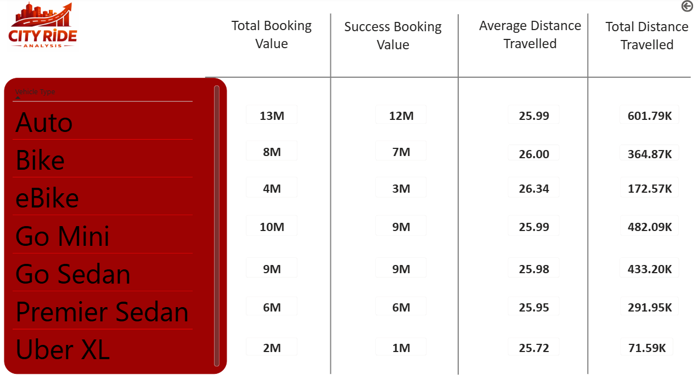
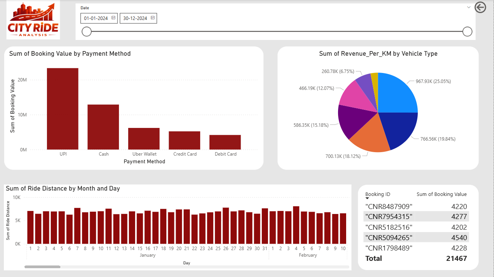
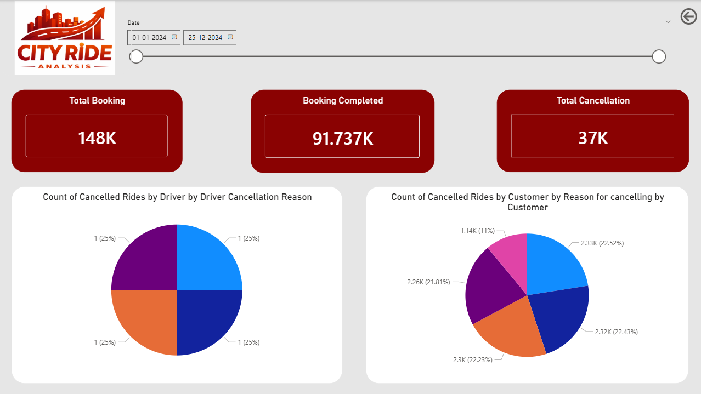

# 🚖 City Ride Analysis - Power BI Dashboard

This project presents a comprehensive analysis of ride booking data using Power BI.  
The dashboard provides insights into booking trends, revenue distribution, vehicle performance, and cancellation patterns.

## 📊 Project Overview

The goal of this project is to analyze city ride booking data and uncover meaningful insights that can help improve operational efficiency and customer satisfaction.

This dashboard helps answer questions such as:
- How many rides are booked overall?
- Which vehicle type generates the highest revenue?
- What are the main cancellation reasons?
- How do customers rate their rides?

---

## 📈 Key Insights

- Total bookings and ride trends analysis
- Revenue generated by different vehicle types
- Ride cancellation breakdown
- Customer ratings distribution
- Vehicle performance comparison

---

## 🛠 Tools & Technologies Used

- Power BI
- Excel
- DAX (Data Analysis Expressions)
- Data Visualization

---

## 📊 Dashboard Pages

1. Vehicle Type Analysis
2. Revenue Analysis
3. Cancellation Analysis
4. Customer Ratings Analysis
5. Summary Dashboard

---

## 📷 Dashboard Preview

### Vehicle Type Dashboard

### Revenue Dashboard

### Cancellation Dashboard

### Ratings Dashboard

### Summary Dashboard

---

## 📂 Project Files

City-Ride-Analysis
│
├── CityRideAnalysis.pbix
├── dataset.csv
├── dashboard1.png
├── dashboard2.png
├── dashboard3.png
├── dashboard4.png
└── README.md

---

## 🚀 Future Improvements

- Add real-time data integration
- Build predictive ride demand analysis
- Implement advanced DAX measures

---

## 👩‍💻 Author

Khushi Kushwah  
Aspiring Data Analyst
